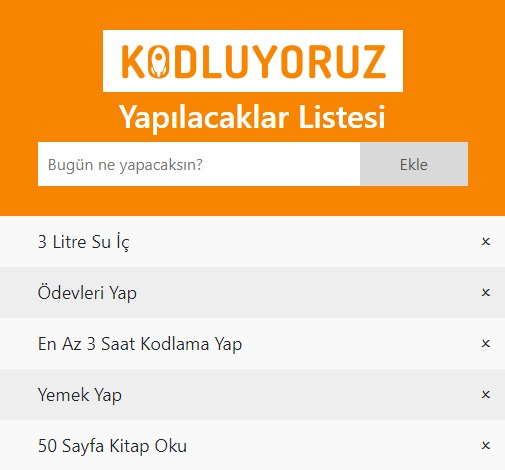

# Javascript - To Do List
Javascript kullanılarak yazılmış bir To Do List projesidir. 



## Installation
Öncelikle projeyi clonelayın.
```
git clone https://github.com/erkinozturk/Javascript-todolist.git
```

## Usage
Projeyi cloneladıktan sonra Visual Studio Code programında açınız.

Linux için:

```
cd Javascript-todolist
code .
```

## Contributing
Pull requestler kabul edilir. Büyük değişiklikler için, lütfen önce neyi değiştirmek istediğinizi tartışmak için bir konu açınız.

## License
[MIT](https://choosealicense.com/)